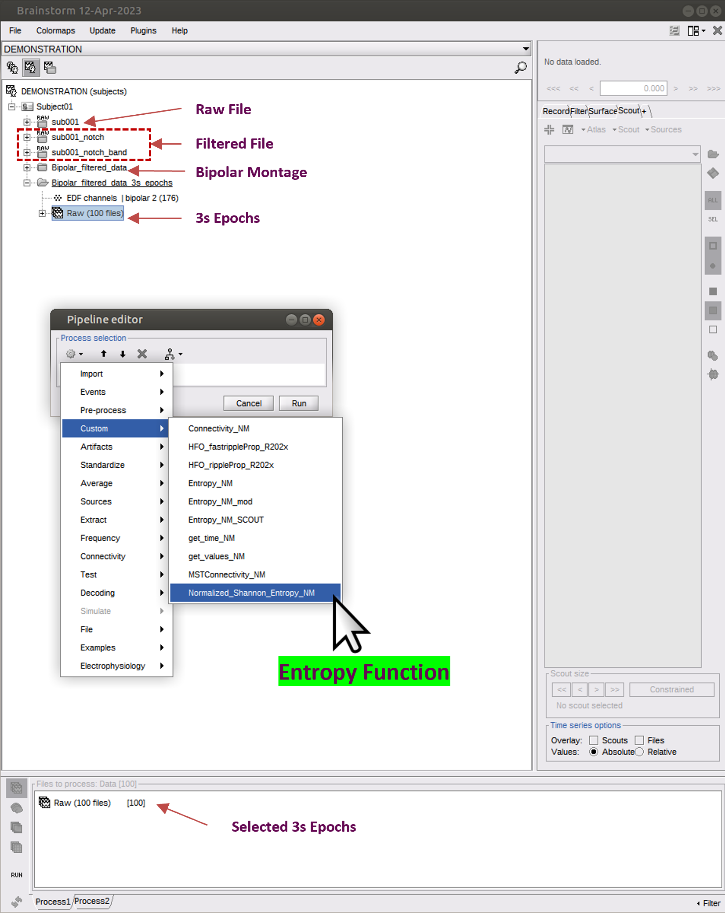
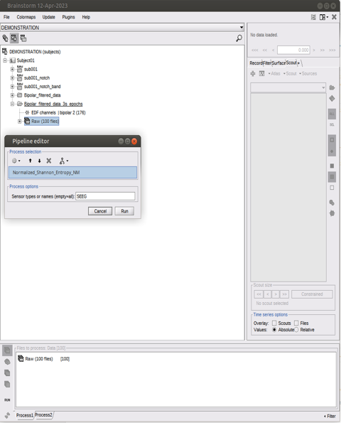
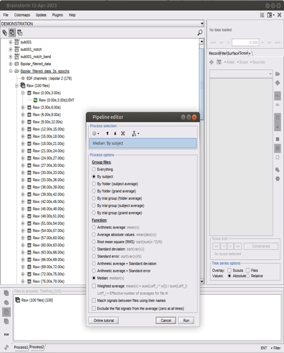
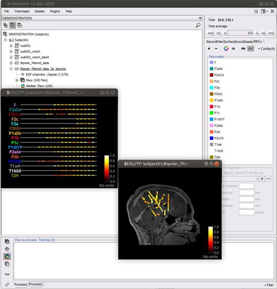
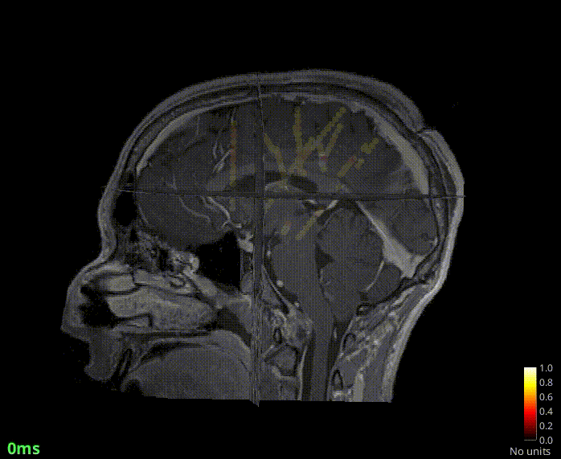

## IEEG Entropy
This Github page contains the Brainstorm process to compute Shannon Entropy values from the iEEG signal
## Bibtex
If you find our project is useful in your research, please cite Makaram et al. (2025):

``
Makaram N, Pesce M, Tsuboyama M, Bolton J, Harmon J, Papadelis C, Stone S, Pearl P, Rotenberg A, Grant EP, Tamilia E. Targeting interictal low-entropy zones during epilepsy surgery predicts successful outcomes in pediatric drug-resistant epilepsy. Epilepsia. 2025 Sep 20. doi: 10.1111/epi.18636. PMID: 40974546.
``
## Prerequisits
- Matlab
- Brainstorm toolbox

## Usage
Download the latest code from the github page and add it to your /$HOME/.brainstorm/process/ folder.
process_normalizedshannon_entropy.m 

Steps to use it with brainstorm
1) Preprocess your signal appropriately and segment to epochs. If you are planning to replicate our work then apply notch and bandpass filter (1 - 500 Hz), apply bipolar montage and then import 3s epochs.

2) Once you open brainstorm you will find this code in the custom folder
3) Drag your signal/epochs into the brainstorm process tab and run the function from the custom code.

4) This will generate a table inside the result_datafile (T_op) which can be exported to matlab and analysed. The generated output is also inside the result_datafile.TF
5) The function will return one file per epoch. Take the median/average using brainstorm function to obtain a single file

A 3D plot can also be generated.

